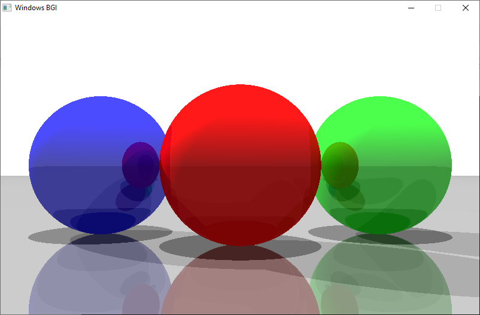

# Ray_tracing_from_scratch
 

 
Project Wiki:
https://github.com/rupak10987/Ray_tracing_from_scratch/wiki#welcome-to-the-ray_tracing_from_scratch-wiki
 
 
 My approach to Make A Ray Traced Rendering Environment using only C++ from scratch.
 Everything is implemented from the very raw level.
 C++ graphics.h is used only for the putpixel(x,y,color) Function.
 
